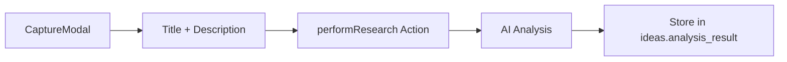
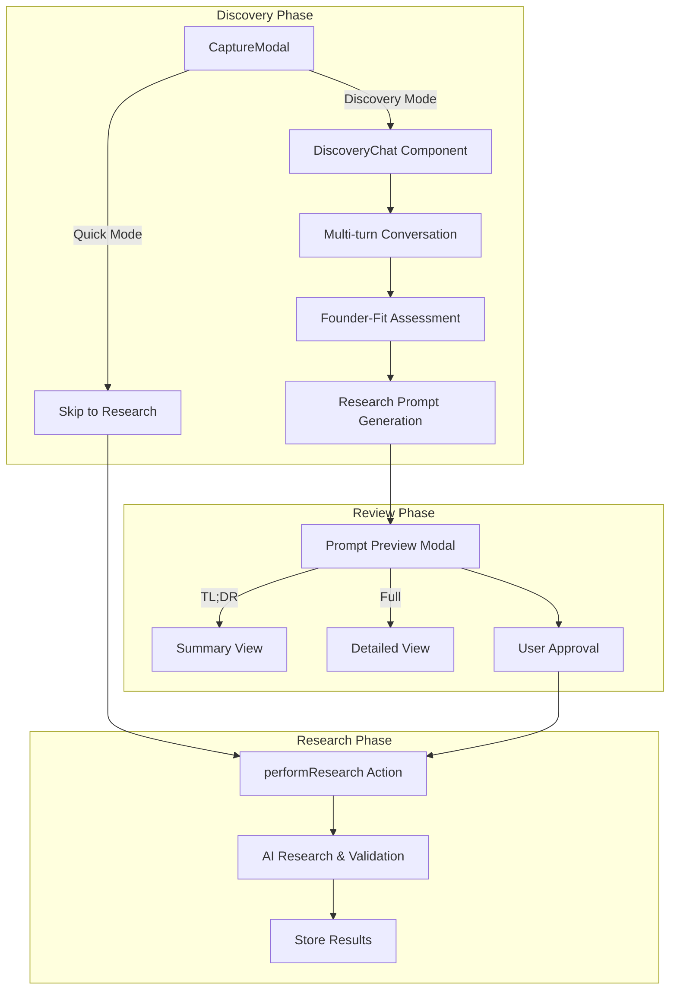

# Collaborative Discovery System for Ideas Vault

Transform the simple idea capture into a **multi-stage collaborative discovery process** where an AI agent helps users refine their raw ideas, assess founder-fit, and generate optimized research prompts.

## Design Decisions (Confirmed)

> [!IMPORTANT]
> **User wants to personally test and refine prompts/process before deployment.** Prompts will be externalized for easy iteration.

**Discovery Mode Entry Points:**
1. **Settings Toggle**: "Start in Discovery Mode" - new ideas automatically enter discovery flow
2. **Existing Idea Action**: "Send to Discovery" button on idea cards/reports to run discovery on prior research

**Implementation Notes:**
- Prompts stored in separate config file for easy testing/refinement
- Conversation history persisted in database
- Founder-fit shown as visible assessment to user

---

## Current Architecture



## Proposed Architecture



---

## Proposed Changes

### Database Schema

#### [MODIFY] schema.sql

Add new table for discovery sessions and update ideas table:

```sql
-- Discovery Sessions Table (stores conversation history)
CREATE TABLE IF NOT EXISTS public.discovery_sessions (
    id UUID PRIMARY KEY DEFAULT gen_random_uuid(),
    idea_id UUID REFERENCES public.ideas(id) ON DELETE CASCADE,
    user_id UUID NOT NULL REFERENCES auth.users(id) ON DELETE CASCADE,
    messages JSONB DEFAULT '[]',
    founder_fit JSONB,
    refined_prompt JSONB,
    status TEXT DEFAULT 'active', -- 'active', 'completed', 'skipped'
    created_at TIMESTAMP WITH TIME ZONE DEFAULT timezone('utc'::text, now()),
    completed_at TIMESTAMP WITH TIME ZONE
);

-- Add discovery_session_id to ideas table
ALTER TABLE public.ideas ADD COLUMN IF NOT EXISTS discovery_session_id UUID REFERENCES public.discovery_sessions(id);
ALTER TABLE public.ideas ADD COLUMN IF NOT EXISTS capture_mode TEXT DEFAULT 'quick'; -- 'quick', 'discovery'
```

---

### Server Actions

#### [NEW] src/app/actions/discovery.ts

Multi-turn conversation handler with structured prompting:

```typescript
// Key functions:
// - startDiscoverySession(): Initialize new session
// - sendDiscoveryMessage(): Process user message, return AI response
// - generateFounderFit(): Assess user's abilities/motivation
// - generateResearchPrompt(): Create optimized prompt from conversation
// - getSessionSummary(): TL;DR and full versions
```

**AI Agent Behavior:**
1. **Phase 1 - Vision Extraction**: Ask clarifying questions about the core problem, solution, and target users
2. **Phase 2 - Gap Analysis**: Probe for unclear assumptions, missing details, or contradictions
3. **Phase 3 - Founder-Fit Assessment**: Evaluate technical skills, domain expertise, resources, and motivation
4. **Phase 4 - Prompt Synthesis**: Generate research prompt with evaluation criteria

---

### Components

#### [NEW] src/components/discovery/DiscoveryChat.tsx

Chat interface for the collaborative discovery process:
- Real-time message stream with typing indicators
- Progress indicator showing current discovery phase
- "Skip to Research" escape hatch
- Session persistence

#### [NEW] src/components/discovery/PromptPreview.tsx

Preview modal showing:
- **TL;DR Tab**: Bullet-point summary of refined idea, founder-fit score, key research areas
- **Full Prompt Tab**: Complete research prompt with all criteria and context
- Approval/Edit buttons

#### [NEW] src/components/discovery/FounderFitCard.tsx

Visual display of founder-fit assessment:
- Skill match radar chart
- Resource availability indicators
- Learning path recommendations
- Hire-vs-learn suggestions

---

#### [MODIFY] src/components/modals/CaptureModal.tsx

Add mode selection at the beginning:
- **Quick Capture**: Current flow (title + description → immediate research)
- **Discovery Mode**: Opens `DiscoveryChat` flow instead

---

#### [MODIFY] src/app/dashboard/page.tsx

Update `handleAddIdea` to support both capture modes and integrate discovery session flow.

---

## Verification Plan

### Manual Verification

Since this is a frontend-heavy feature with AI conversation, I recommend:

1. **Discovery Flow Test**: 
   - Open the app → Click "New Idea" → Select "Discovery Mode"
   - Have a multi-turn conversation with the AI
   - Verify founder-fit assessment appears
   - Review generated prompt (TL;DR and Full)
   - Approve and confirm research begins

2. **Quick Mode Test**:
   - Verify the original quick capture still works unchanged

3. **Database Persistence Test**:
   - Mid-conversation, refresh the page
   - Confirm session is restored (if we implement persistence)

> [!TIP]
> **Will Include**: Test script for simulating conversation flow with mock AI responses, plus externalized prompt config file for easy refinement.
