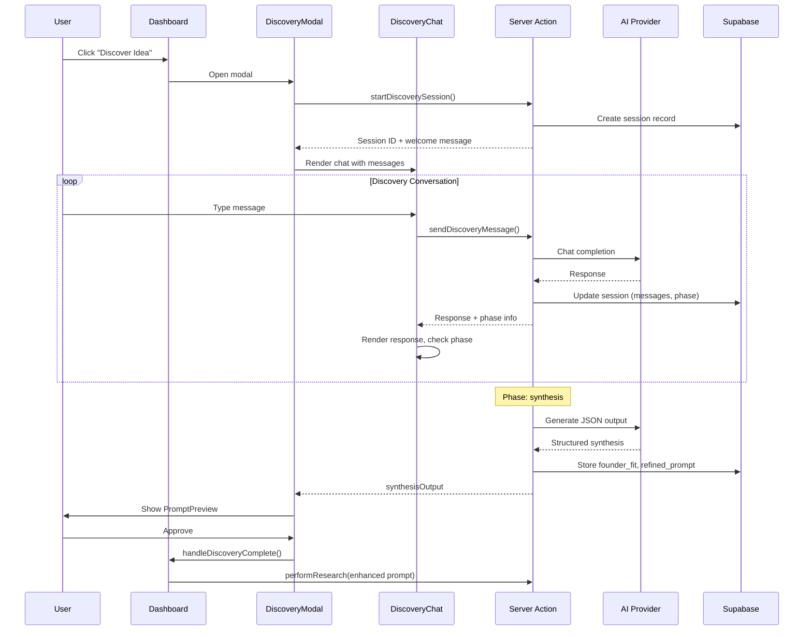

# Collaborative Discovery System - Implementation Walkthrough

## Summary

Successfully implemented a **multi-stage collaborative discovery process** for the Ideas Vault app. Users can now optionally engage in an AI-guided conversation to refine their raw startup ideas before research begins.

## What Was Built

### Entry Points

1. **Settings Toggle**: "Discovery Mode" switch in Settings - when enabled, new ideas automatically start with the discovery conversation
2. **Dashboard Integration**: When Discovery Mode is active, the "New Idea" button becomes "Discover Idea" with a sparkles icon

---

## New Files Created

### Server-Side

| File | Purpose |
|------|---------|
| [discoveryPrompts.ts](file:///d:/code/Ideas_Vault/src/config/discoveryPrompts.ts) | Externalized prompts for easy testing/refinement |
| [discovery.ts](file:///d:/code/Ideas_Vault/src/app/actions/discovery.ts) | Server action handling multi-turn conversation |

### UI Components

| File | Purpose |
|------|---------|
| [DiscoveryChat.tsx](file:///d:/code/Ideas_Vault/src/components/discovery/DiscoveryChat.tsx) | Chat interface with phase indicators |
| [PromptPreview.tsx](file:///d:/code/Ideas_Vault/src/components/discovery/PromptPreview.tsx) | TL;DR + full prompt preview modal |
| [FounderFitCard.tsx](file:///d:/code/Ideas_Vault/src/components/discovery/FounderFitCard.tsx) | Visual founder-fit assessment card |
| [DiscoveryModal.tsx](file:///d:/code/Ideas_Vault/src/components/modals/DiscoveryModal.tsx) | Main orchestrator modal for discovery flow |

### Testing

| File | Purpose |
|------|---------|
| [testDiscoveryPrompts.ts](file:///d:/code/Ideas_Vault/scripts/testDiscoveryPrompts.ts) | CLI script for prompt iteration |

---

## Modified Files

render_diffs(file:///d:/code/Ideas_Vault/schema.sql)

render_diffs(file:///d:/code/Ideas_Vault/src/components/modals/SettingsModal.tsx)

render_diffs(file:///d:/code/Ideas_Vault/src/app/dashboard/page.tsx)

---

## Discovery Flow Architecture



---

## Database Schema Updates

New table `discovery_sessions`:
- `messages` - JSONB array of conversation history
- `current_phase` - Tracks vision → gaps → founder_fit → synthesis → complete
- `founder_fit` - Stores structured assessment
- `refined_prompt` - Stores generated research prompt

New columns on `ideas`:
- `capture_mode` - 'quick' or 'discovery'
- `discovery_session_id` - Foreign key to session

---

## Prompt Testing

To iterate on discovery prompts without the full app:

```bash
# Install tsx if not present
npm install -D tsx

# Run the interactive test
npx tsx scripts/testDiscoveryPrompts.ts
```

Commands in the test script:
- `/phase` - Show current discovery phase
- `/advance` - Force advance to next phase
- `/history` - Show conversation history
- `/quit` - Exit

---

## How to Test in App

1. **Enable Discovery Mode**:
   - Open app → Dashboard → Settings (gear icon)
   - Toggle "Discovery Mode" ON
   - Save

2. **Start Discovery**:
   - Click "Discover Idea" (now shows sparkles icon)
   - Have a conversation with the AI about your idea
   - Watch the phase indicator progress

3. **Review Output**:
   - Once synthesis completes, review the TL;DR and full prompt
   - See your founder-fit assessment
   - Click "Start Research" to proceed

> [!TIP]
> You can edit prompts in [discoveryPrompts.ts](file:///d:/code/Ideas_Vault/src/config/discoveryPrompts.ts) to refine the AI's behavior. Changes are picked up on next server restart.

---

## Validation

- ✅ TypeScript compiled without errors
- ✅ All new components created
- ✅ Database schema updated
- ✅ Integration with existing capture flow
- ⏳ Ready for manual E2E testing
